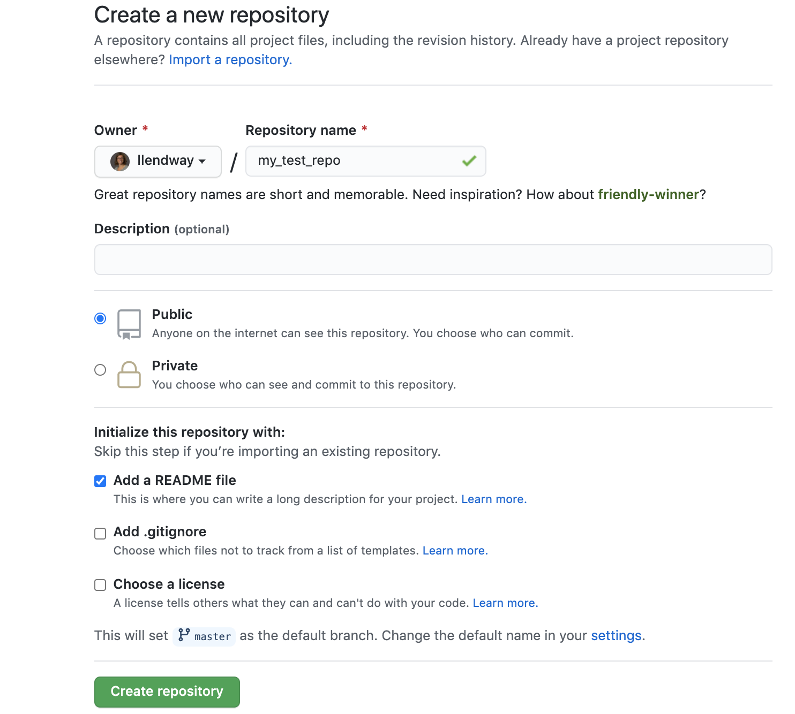
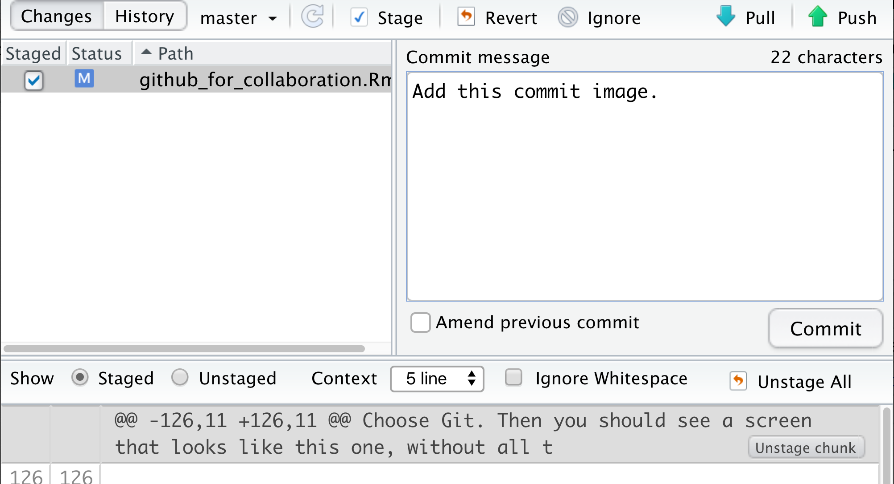
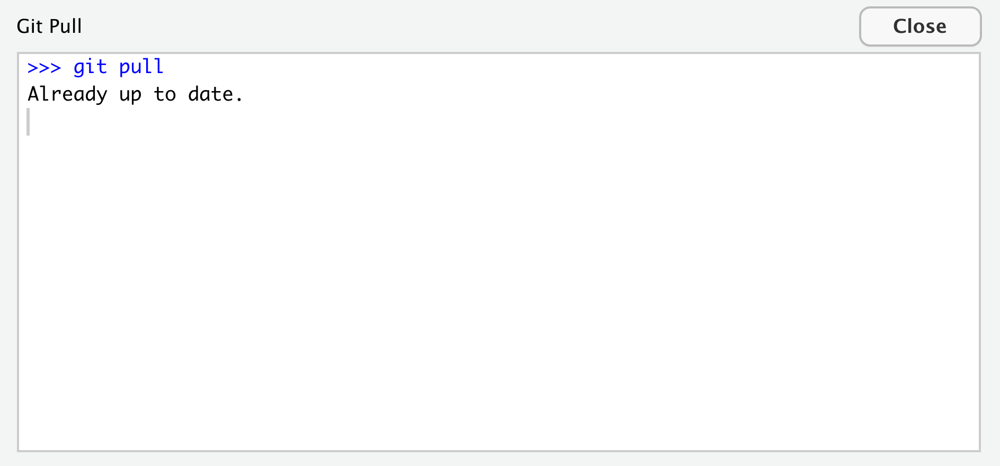

```{r, message=FALSE, echo=FALSE}
library(tidyverse)
```

# Informacja

Duża część tego materiału została zaadaptowana z [Happy git with R autorstwa Jenny Bryan](https://happygitwithr.com/). To doskonałe źródło, ale zawiera wiele informacji, których nie potrzebujemy na tych zajęciach. Jeśli chcesz używać Gita i GitHuba w bardziej zaawansowany sposób lub jeśli moje instrukcje nie są wystarczająco jasne, zdecydowanie warto tam zajrzeć. 

# Samouczek wideo

W pierwszym video-tutorialu pokazano jak zainstalować Git i skonfigurować go z R Studio. W drugim video-tutorialu pokazano, jak utworzyć repozytorium, sklonować je, dodać plik, zatwierdzić zmiany i wypchnąć je na GitHub (praca dwóch osób pracujących na jednym repo).

<iframe width="560" height="315" src="https://www.youtube.com/embed/QLFc9gw_Hfs" frameborder="0" allow="accelerometer; autoplay; clipboard-write; encrypted-media; gyroscope; picture-in-picture" zezwól na pełny ekran dane-zewnętrzne="1"></iframe>


<iframe width="560" height="315" src="https://www.youtube.com/watch?v=megZYkCLMA4" frameborder="0" allow="accelerometer; autoplay; clipboard-write; encrypted-media; gyroscope; picture-in-picture" zezwól na pełny ekran dane-zewnętrzne="1"></iframe>

[Voicethread tutorial](https://voicethread.com/share/15440257/)

# Git i GitHub

Git to system kontroli wersji. Jest podobny do Google Docs, ale obsługuje wiele typów plików, których Google Docs nie może ... jak pliki .rmd! GitHub to interfejs online do pracy z Gitem. 

Dlaczego uczymy się tych rzeczy?

1. GitHub jest dobrze zintegrowany z R Studio. Nie będziemy więc musieli używać żadnych funkcji wiersza poleceń, przynajmniej nie po skonfigurowaniu wszystkiego.

2. Wymagane jest użycie R do końcowego projektu. Prezentacja lub referat muszą być zapisane jako dokument .rmd, który można połączyć z dokumentem html. Korzystanie z GitHub pozwoli na łatwą pracę z grupą, nawet jeśli nie jesteście razem.

3. GitHub uczy dobrych nawyków. Jesteś zmuszony do myślenia o tym, kiedy zapisujesz i do robienia notatek o tym, jakie zmiany wprowadziłeś za każdym razem, gdy to robisz.


# Utwórz konto GitHub

* Przejdź do http://github.com i utwórz konto.
* Utwórz nazwę użytkownika ... zobacz [wskazówki] Jenny Bryan (https://happygitwithr.com/github-acct.html). Uwzględnij swoje rzeczywiste imię i nazwisko, użyj innej nazwy użytkownika, którą już posiadasz, * wybierz nazwę użytkownika, którą będziesz mógł ujawnić przyszłemu szefowi*. 

# Zainstaluj i skonfiguruj Git

  1. Sprawdź, czy masz już zainstalowany Git. Będzie to miało miejsce tylko wtedy, gdy używałeś go gdzie indziej. Aby to zrobić, otwórz terminal lub w R Studio rozwiń konsolę. Powinna tam być zakładka Terminal. W tym obszarze wpisz:

```
which git
```

Jeśli zwróci to coś takiego jak

```
/usr/bin/git
```

wtedy skończyłeś i nie musisz instalować Gita. 

Na komputerze z systemem Windows możesz nawet nie być w stanie pomyślnie wpisać polecenia `which git`. Powinno to zostać naprawione przez zainstalowanie git. Albo będziesz musiał użyć powłoki. Możesz także spróbować wpisać `where git`.

  2. Jeśli nie masz zainstalowanego Gita, musisz go zainstalować. Instrukcje są nieco inne dla systemów Windows i Mac.

  **W systemie Windows:**

  * Zainstaluj [Git dla Windows](https://gitforwindows.org/). Gdy pojawi się pytanie o „Dostosowanie środowiska PATH”, upewnij się, że wybrano opcję „Git z wiersza poleceń, a także z oprogramowania innych firm”. W przeciwnym razie uważamy, że dobrze jest zaakceptować wartości domyślne. 
  * R Studio dla Windows preferuje, aby Git był zainstalowany poniżej C:/Program Files i wydaje się, że jest to ustawienie domyślne. Oznacza to na przykład, że plik wykonywalny Git w moim systemie Windows znajduje się w C:/Program Files/Git/bin/git.exe. O ile nie masz szczególnych powodów, aby postąpić inaczej, postępuj zgodnie z tą konwencją.
  
 **Na Macu:**

  * Przejdź do *shell/terminal* i wprowadź **jedno** z tych poleceń, aby wyświetlić ofertę instalacji narzędzi wiersza poleceń dla programistów. Zaakceptuj ofertę ... kliknij zainstaluj.
  
```
git --version
git config
```

  * Niektórzy użytkownicy komputerów Mac mogą być zmuszeni do wykonania poniższych czynności w *terminalu*, jeśli próba otwarcia projektu zakończy się niepowodzeniem. Za chwilę dowiesz się, czy tak jest w tym przypadku.
  
```
xcode-select --install
```

  3. Teraz wróć do *Console* w R Studio i zainstaluj pakiet `usethis` w R Studio. Następnie zamknij R Studio i otwórz je ponownie. 

  4. Załaduj bibliotekę `usethis` uruchamiając następujący fragment kodu w *konsoli*: 

```
library(usethis)
```


  5. Uruchom poniższy kod w *console* z kilkoma drobnymi zmianami. `user.name` to nazwa użytkownika Git. Może się ona różnić od nazwy użytkownika GitHub, choć dobrym pomysłem może być pozostawienie jej takiej samej. Adres `user.email` *MUSI* być taki sam jak adres e-mail użytkownika GitHub. 

```
use_git_config(user.name = „Jane Doe”, user.email = „jane@example.org”)
```


# Skonfiguruj PAT

PAT, czyli Personal Access Token, jest teraz niezbędny (lub będzie wkrótce), aby RStudio i GitHub mogły ze sobą rozmawiać. Jenny Bryan omawia to w rozdziale 10 [Happy Git with R](https://happygitwithr.com/credential-caching.html#credential-caching), a David Keyes omawia to w swoim poście na blogu [How to Use Git/Github with R](https://rfortherestofus.com/2021/02/how-to-use-git-github-with-r/) (zobacz sekcję Connect RStudio and GitHub).

1. Najpierw uruchom funkcję `create_github_token()` z biblioteki `usethis` w konsoli. Spowoduje to przejście do witryny GitHub, gdzie można utworzyć token - przechowuj go w bezpiecznym miejscu i nie zgub go! Będziesz go potrzebować za chwilę i być może kiedyś w odległej przyszłości.  
2. Zainstaluj pakiet `gitcreds` w RStudio i załaduj bibliotekę używając `library(gitcreds)` (możesz to zrobić w konsoli).  
3. Uruchom funkcję `gitcreds_set()` w konsoli. Jeśli masz dostępne opcje, wybierz opcję Zastąp te dane uwierzytelniające, a następnie wklej PAT, który właśnie utworzyłeś w poprzednim kroku.  
4. Podczas następnego zatwierdzania i wypychania może nadal pytać o nazwę użytkownika i hasło github, **użyj PAT, gdy zapyta o hasło !!! **.


Daj mi znać, jeśli masz problemy z którymkolwiek z tych kroków. Moją pierwszą sugestią zawsze będzie ponowne uruchomienie komputera. Niestety, kiedyś spędziłem dwie godziny próbując debugować błędy git tylko po to, by zostały magicznie naprawione po ponownym uruchomieniu. Nie bądź taki jak ja.

# Utwórz swoje pierwsze repo i używaj go z R Studio

Słowo „repo” jest skrótem od repozytorium i dokładnie tym jest: miejscem do przechowywania rzeczy (w tym przypadku naszych plików). To tak, jakbyś utworzył folder do przechowywania całej swojej pracy dla tej klasy. 

Przejdźmy do [GitHub](https://github.com/) i zalogujmy się. Po zalogowaniu powinieneś zobaczyć małą ikonę w prawym górnym rogu. Moja przedstawia mnie. Jeśli ją kliknę, pojawi się menu rozwijane i będę mógł wybrać „Twoje repozytoria”. Zrób to. Powinieneś zobaczyć coś takiego:


Kliknij przycisk „Nowy”. Nazwij swoje repozytorium `NAME_test_repo`, gdzie `NAME` to twoje imię i nazwisko. Wybierz Public i zaznacz pole obok Add a README file. Następnie kliknij Utwórz repozytorium.



Istnieją rzeczy, które można zrobić bezpośrednio w GitHub, ale my skupimy się na jego integracji z R Studio. 

# Klonowanie repozytorium

Klonowanie repozytorium jest „kopiowaniem” repozytorium na komputer. Ale podczas kopiowania zachowuje połączenie z repozytorium online. 

Zróbmy tak. Na stronie my_test_repo wybierz zielony przycisk z napisem Code i skopiuj ścieżkę, podświetlając i klikając ikonę przypominającą notatnik ze strzałką. 

Teraz przejdź do R Studio. Kliknij File --> New Project .... Powinieneś zobaczyć okno, które wygląda tak:


Wybierz opcję Kontrola wersji. Następnie powinieneś zobaczyć ekran, który wygląda tak:


Wybierz Git. Następnie powinieneś zobaczyć ekran, który wygląda jak ten, bez wypełnionych wszystkich szczegółów. Adres URL repozytorium to miejsce, w którym należy wkleić adres URL repozytorium sklonowanego z github. Zostanie również wypełniona nazwa katalogu projektu. Po prostu zostaw to. **Zwróć uwagę** na to, gdzie znajduje się katalog projektu i w razie potrzeby zmień go na lepszy. Kliknij Create Project. 


Jeśli spojrzysz na zakładkę Pliki w prawym dolnym panelu R Studio, powinieneś zobaczyć plik .gitignore, plik projektu (kończy się na .Rproj) i plik README.md. Powinieneś także zobaczyć zakładkę Git w prawym górnym panelu w R Studio. Jeśli klikniesz teraz na zakładkę Git, nic tam nie zobaczysz.  

Po otwarciu zakładki Git otwórzmy plik README.md w R Studio. Wprowadź niewielką zmianę w pliku, dodając zdanie „Zmieniam coś w tym pliku”. Następnie kliknij ikonę zapisu. Po wykonaniu tej czynności plik README.md pojawi się w zakładce Git. 

Teraz kliknij przycisk Zatwierdź w zakładce Git. Zaznacz pole wyboru obok pliku README.md pod słowem *Staged* (w przyszłości możesz wystawić wiele plików jednocześnie, zaznaczając pola obok wielu plików) i **dodaj komentarz do pola zatwierdzenia**. Powinien on wyglądać mniej więcej tak:



Na koniec kliknij przycisk Zatwierdź. Pojawi się komunikat informujący o zakończeniu. Wiadomość może wydawać się tajemnicza, jeśli nie jesteś do nich przyzwyczajony. Wygląda on mniej więcej tak:


Wprowadzona zmiana została zatwierdzona (gra słów zamierzona!) do pamięci lokalnej. Zmieniony plik jest zmieniany tylko na komputerze, NIE online, jeśli spojrzysz na GitHub ... idź sprawdzić. Kliknij przycisk Diff w zakładce Git, a zobaczysz historię swoich commitów. 

Następnie zamierzamy przesłać te zmiany do GitHub, klikając zieloną strzałkę w górę na karcie Git. Spowoduje to wyświetlenie komunikatu, który wygląda mniej więcej tak:


Czy zostałeś poproszony o podanie nazwy użytkownika i hasła? Spróbuj wprowadzić kolejną modyfikację, zatwierdzić i wysłać. Czy nadal pojawia się monit o nazwę użytkownika i hasło? Jeśli tak, wróć i upewnij się, że skonfigurowałeś osobisty token dostępu (PAT).

**TWOJA KOLEJ!

1. Dodaj plik .rmd do swojego projektu. W tym celu wybierz Plik --> Nowy plik --> R Markdown .... Dodaj kilka słów i fragment kodu R do pliku .rmd. Zapisz go, zatwierdź (nie zapomnij o wiadomości!) i wyślij. Sprawdź GitHub online, aby upewnić się, że widzisz tam plik .rmd. 

2. Teraz dziergaj plik lokalnie. Zatwierdź zmiany (pamiętaj, aby zaznaczyć wszystko, co chcesz wystawić - .rmd, .html itp.) i wypchnij je do GitHub. Sprawdź GitHub online, aby upewnić się, że widzisz wszystko, czego oczekujesz. 

# Dodawanie współpracowników

Do tej pory tak naprawdę poznaliśmy tylko techniki korzystania z GitHub do zarządzania własnymi plikami, ale najfajniejszą częścią tego narzędzia są jego funkcje współpracy. Sposobem, w jaki zamierzamy się tego nauczyć, jest dodawanie współpracowników do repozytorium. 

Znajdź kogoś do współpracy w klasie. Jeśli jest ich nieparzysta liczba, stwórz grupę składającą się z trzech osób. W swojej małej grupie dodajcie siebie nawzajem jako współpracowników do projektu. W serwisie GitHub, na stronie repozytorium, przejdź do Ustawień. Jedną z opcji po lewej stronie są Współpracownicy. Kliknij ją i postępuj zgodnie z instrukcjami. 

Osoba, która została zaproszona do współpracy, otrzyma wiadomość e-mail i powinna być w stanie zobaczyć zaproszenie na GitHub. Musi je zaakceptować. Po zaakceptowaniu oboje powinniście mieć dostęp do zatwierdzania zmian w pliku.

# Commit --> Push --> Pull --> ... (i komunikacja)

Po dodaniu współpracowników wszyscy współpracownicy mogą zatwierdzać i wypychać zmiany. Ale co się stanie, jeśli ktoś zatwierdzi i wypchnie coś, a następnie pójdziesz pracować nad tym na swoim komputerze ... jak uzyskać te zmiany? ... PULL!

W swoich grupach spróbuj wykonać następujące czynności. Każdy z was powinien być współpracownikiem w swoich projektach, więc możecie zmienić role po zrobieniu tego raz.

1. Współpracownik musi najpierw sklonować repozytorium, nad którym został poproszony o współpracę. Jeśli ma otwarty inny projekt, zapisać, zatwierdzić i wypchnąć wszelkie zmiany. Następnie zamknij ten projekt i otwórz projekt, o którego współpracę został poproszony, klonując repozytorium GitHub. Współpracownik powinien mieć otwarty projekt w R Studio.  

2. Współpracownik powinien spróbować pociągnąć, klikając wodną strzałkę w dół w zakładce Git. Powinien pojawić się komunikat, który wygląda następująco:



3. Osoba, która utworzyła repozytorium, wprowadza zmianę w swoim pliku .rmd. Może to być niewielka zmiana, na przykład dodanie zdania. Ta sama osoba zapisuje plik, zatwierdza (etap i zapisuje wiadomość zatwierdzenia) i przesyła go do GitHub. Sprawdź online, aby upewnić się, że najnowsze zmiany zostały wypchnięte.

4. Współpracownik pobiera teraz te zmiany do swojego lokalnego katalogu (na swój komputer). Kliknij ikonę pobierania. Powinieneś zobaczyć wiadomość podobną do tej:


Sprawdź plik, w którym dokonano zmiany, aby upewnić się, że zmiana została odzwierciedlona w pliku na komputerze. 

5. Przejdź tam i z powrotem jeszcze kilka razy, wprowadzając drobne zmiany. Ten, kto jest właścicielem repozytorium, powinien dokonać zmiany, a współpracownik powinien ją wprowadzić. Następnie zamieńcie się rolami. Podczas przełączania upewnij się, że pracujesz z właściwym projektem. 

# Scal konflikty

Podczas wspólnej pracy nad projektem może się zdarzyć, że dwie osoby będą edytować ten sam plik w tym samym czasie. Czasami, jeśli oboje spróbujecie wypchnąć swoje zmiany, pojawi się tak zwany „konflikt scalania”. GitHub nie będzie wiedział, którego z nich użyć. Zmusi Cię więc do podjęcia decyzji. 

Gdy spróbujesz przesłać swoje zmiany do GitHub, a ktoś inny już przesłał swoje zmiany dotyczące tego samego pliku, otrzymasz komunikat taki jak ten:


Następnie, po wciągnięciu zmian, pojawi się następujący komunikat:


Zauważ, że informuje on o pliku, w którym wystąpił konflikt scalania. Musisz otworzyć ten plik i zdecydować, jak scalić sprzeczne informacje. Na początku będzie to wyglądać mniej więcej tak:


Część po słowie `HEAD` jest tym, co znajduje się w lokalnym pliku. Wszystko po `======` jest tym, co znajduje się w pliku zdalnym (tj. zmiany wprowadzone przez współpracownika). Możesz zdecydować się na naprawienie tego w dowolny sposób: połączyć oba pomysły, usunąć oba, zachować tylko jeden itp. Po zakończeniu upewnij się, że pozbyłeś się `<<<<<<< HEAD` i `>>>>>>> `, po których następuje ciąg alfanumeryczny oraz wszelkie inne dziwne znaki.

Następnie zapisz plik i wykonaj zwykłe zatwierdzenie i wypchnięcie. Powinieneś zobaczyć zmiany wypchnięte do GitHub.

# Praca zespołowa!

1. W grupach 3-4-osobowych przećwicz swoje umiejętności GitHub.

  a. Wybierz kogoś do utworzenia nowego repo na GitHub o nazwie our_collaborative_graph.  
  b. Twórca dodaje pozostałe osoby jako współpracowników.  
  c. Współpracownicy powinni sprawdzić swoją pocztę e-mail i zaakceptować bycie współpracownikami.  
  d. Twórca i współpracownicy klonują repozytorium lokalnie.  
  e. Współpracownik dodaje lokalnie plik .rmd do projektu. Tytuł powinien brzmieć „Our graph” i dodawać wszystkich członków grupy jako autorów. Dodaj fragment kodu R, który ładuje bibliotekę `tidyverse`. Zapisz plik, zatwierdź z komunikatem i wypchnij na GitHub. Sprawdź online, aby upewnić się, że plik został poprawnie przesłany.  
  f. Wszyscy pozostali członkowie grupy pobierają zmiany lokalnie.  
  g. Inny współpracownik dodaje kolejny fragment kodu R. Korzystając ze zbioru danych *mpg*, utwórz wykres punktowy z *hwy* na osi y, *displ* na osi x i pokoloruj punkty według *drv*. Zapisz zmiany. Zatwierdź plik. Następnie zatwierdź z komunikatem i wypchnij na GitHub. Upewnij się, że wszystkie pliki zostały zatwierdzone. Sprawdź online, aby upewnić się, że widzisz zmiany.  
  h. Wszyscy pozostali członkowie grupy pobierają zmiany lokalnie. 
 i. Inny członek grupy (współpracownik lub twórca, jeśli masz tylko 3 członków grupy) modyfikuje fragment kodu R, który tworzy wykres, dodając ładne etykiety x i y oraz zmieniając `theme_minimal()`. Zapisz zmiany. Zatwierdź plik. Następnie zatwierdź z wiadomością i wyślij na GitHub. Upewnij się, że wszystkie pliki zostały zatwierdzone. Sprawdź online, aby upewnić się, że widzisz zmiany.   
  j. Wszyscy członkowie grupy ciągną. Osoba, która właśnie dokonała push powinna zobaczyć, że jest już na bieżąco. Wszyscy inni powinni zobaczyć zmiany odzwierciedlone lokalnie.   
  k. Teraz wszyscy członkowie grupy powinni dodać coś do pliku .rmd. Nie mówcie sobie nawzajem, co dodajecie. Gdy skończycie, zapiszcie, zatwierdźcie i wyślijcie do GitHub. Przynajmniej jeden z was otrzyma konflikt scalania, więc poprosi cię o pobranie zmian z GitHub i naprawienie konfliktu. Zrób to. Tym razem będziesz musiał zmodyfikować plik .rmd, a nie README, jak pokazałem wcześniej.  


# Źródło

[Happy git with R autorstwa Jenny Bryan](https://happygitwithr.com/): świetne źródło, choć sporo w nim odniesień do wiersza poleceń.


